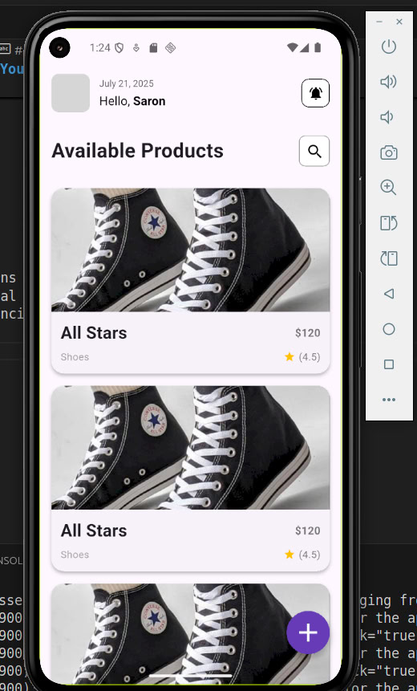
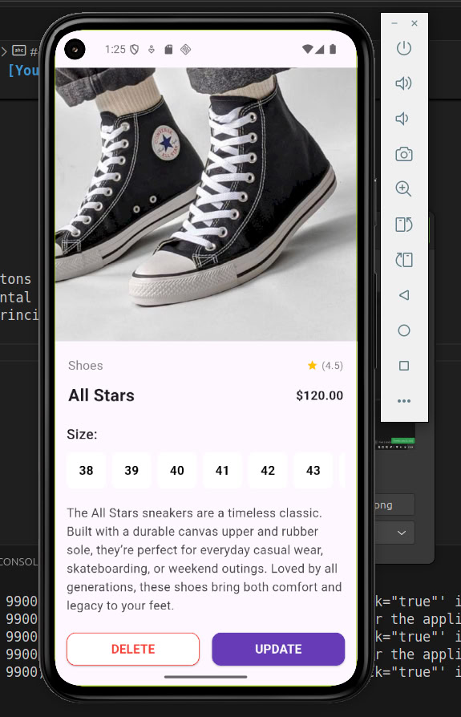
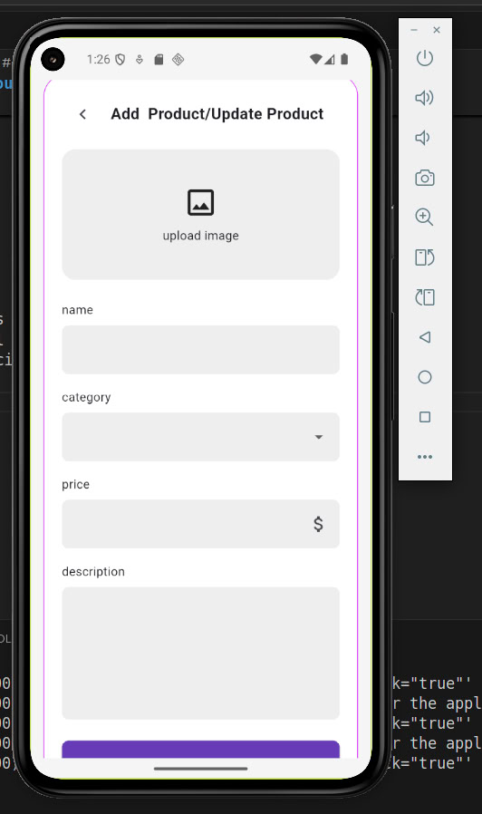
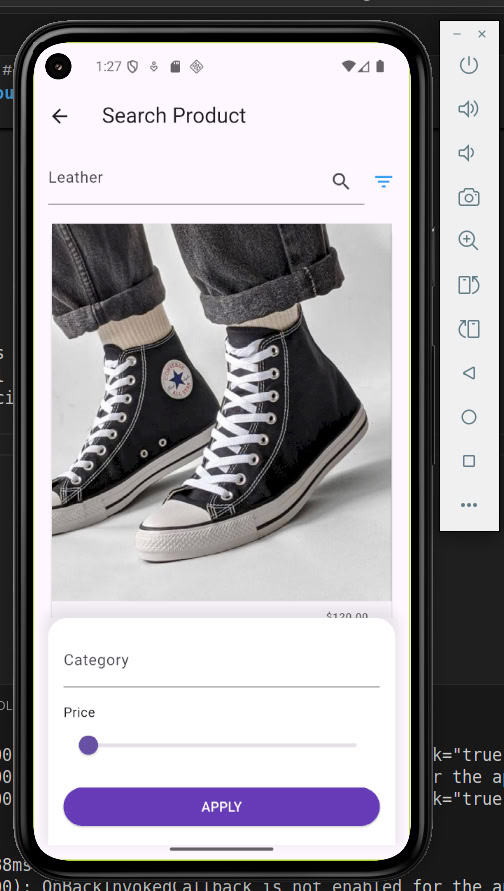

# Flutter UI Task - [Your Name]

This project is a Flutter user interface implementation based on a provided design reference. The UI was carefully recreated to match the original layout, typography, and styling using core Flutter widgets.

## Overview

The UI includes:
- Product image and detail section
- Category and rating row
- Product name and price
- Shoe size selector (interactive)
- Product description
- Bottom action buttons (Delete & Update)

## 🛠 Tech Stack

- Flutter
- Dart

## 📸 Screenshots







## Features

- Responsive layout
- Custom-styled buttons
- Scrollable horizontal size selection
- Material design principles followed

## How to Run

```bash
flutter pub get
flutter run
```